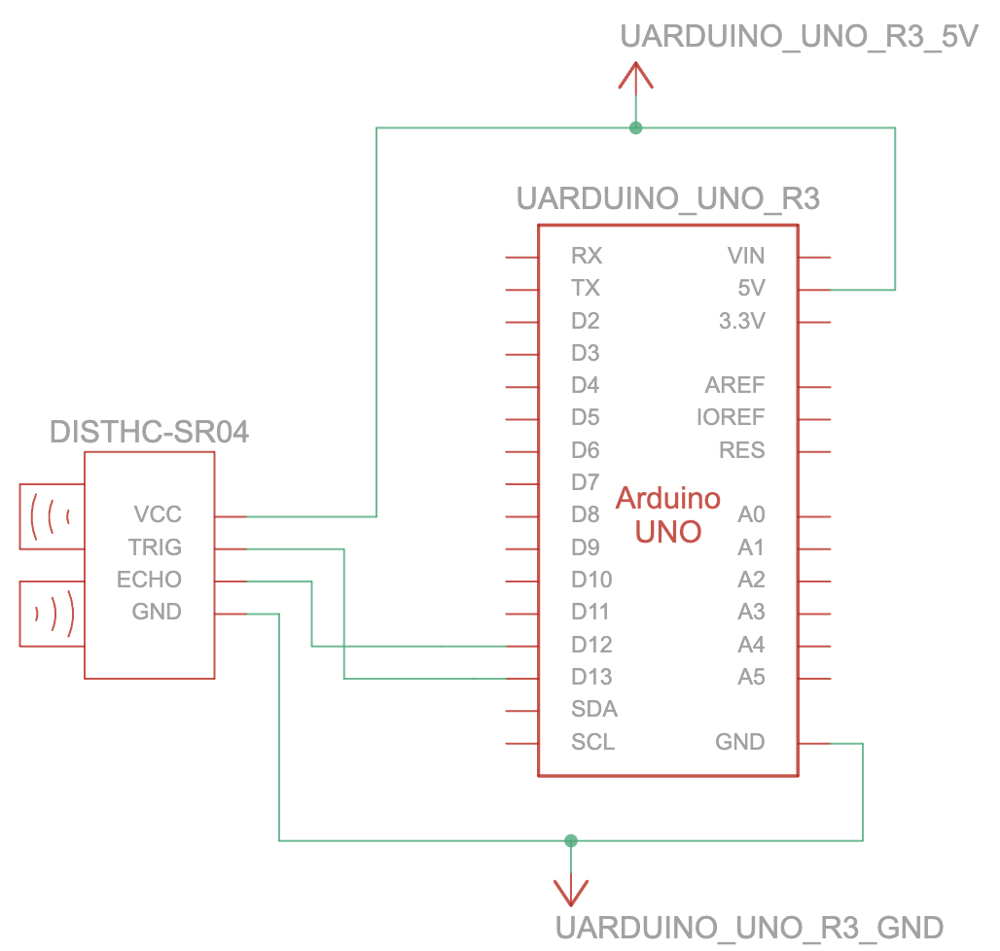

# Dobot Magician Surface Mapper
This repository contains the code and documentation for the Dobot Magician Surface Mapper Honors Project. 

The aim is to map the a surface using  data from a sensor attached to the end of the Dobot Magician robot arm to determine if there is an object in the working area, using Macine Learning. Then, if there is an object, to determine the best place to position the suction cup end affector.

## Context diagram

## Arduino Ultrasonic Schematics

## Potential Improvements

- Better attachment or rig for sensor (3D Printing?)
- Array of sensors instead of a single one to scan more surface area faster
- Quicker sensors to gather more data in less time
- Lidar sensor instead of Ultrasonic sensor
- Using I/O ports on robot arm instead of reading data from serial port using USB cable
- Exporting data to flat CSV file instead of nested JSON so it’s ready for analysis immediately

## Resources

### I/O (Specs)

* Communication interface/UART interface: Connect with Bluetooth, WIFI and so on.  The Dobot protocol is adopted.
  * Source: p 14, [Dobot Magician V2 User Interface](https://download.dobot.cc/DobotStudio-pro/20230816/Dobot%20Magician%20V2%20User%20Guide%20%28DobotLab-based%29%20V2.3.1.pdf)
  * Couldn’t access document online about dobot protocol, but did find the following resources:
    * [TCP/IP Protocol — Dobot CR-Series Documentation](https://docs.trossenrobotics.com/dobot_cr_cobots_docs/tcpip_protocol.html) (note that this is for another robot arm from the same company, but I reckon the info should be transferable at least, since the user manual seems to imply there’s a common protocol. The site also has a section on I/O)
    * [TCP-IP-Protocol-4AXis](https://github.com/Dobot-Arm/TCP-IP-Protocol-4AXis)
* Looks like there are two areas on the arm for UART inputs, and as far as I can tell it’s possible to configure whatever port that isn’t in use on the forearm to be a port for something else. There’s also the possiblity to configure (one of the) the ports on the base to receive whatever input you like.

### General

* [Video that connects a pixi sensor to the dobot magician via some of the input ports](https://youtu.be/WgziV1RqJ6M)
* [Reading data from the Arduino serial port with Python](https://projecthub.arduino.cc/ansh2919/serial-communication-between-python-and-arduino-663756)
