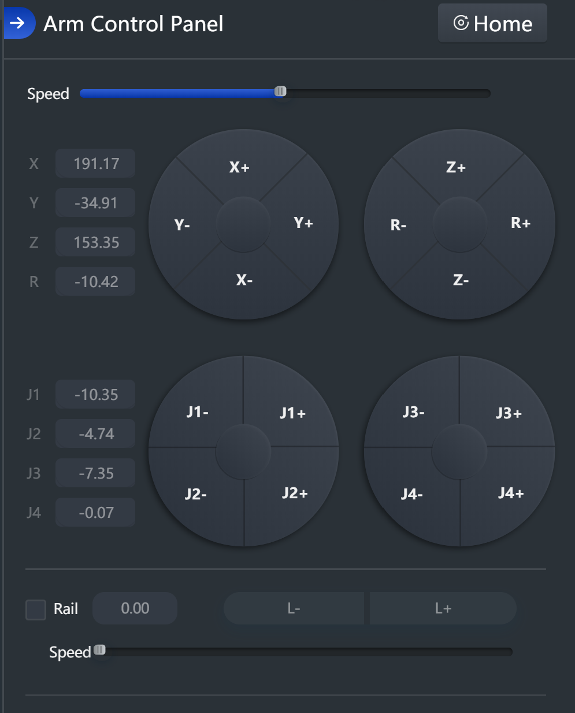
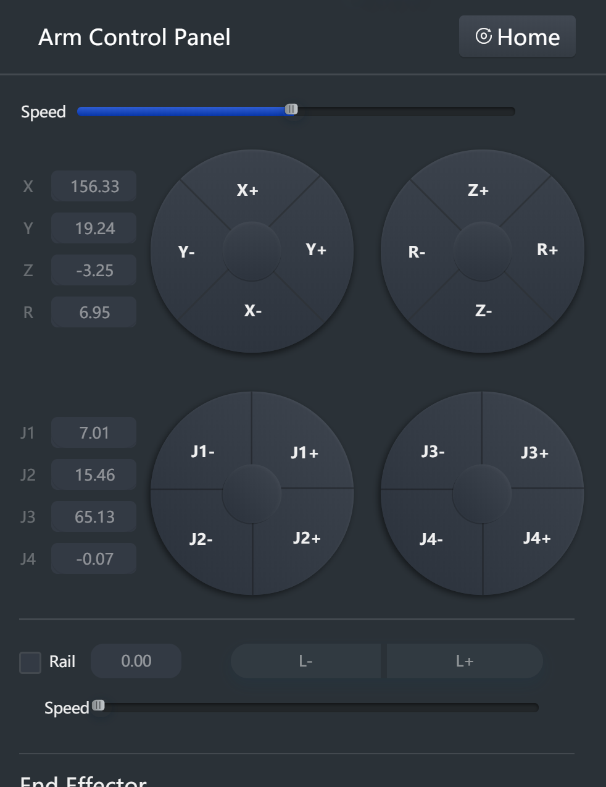
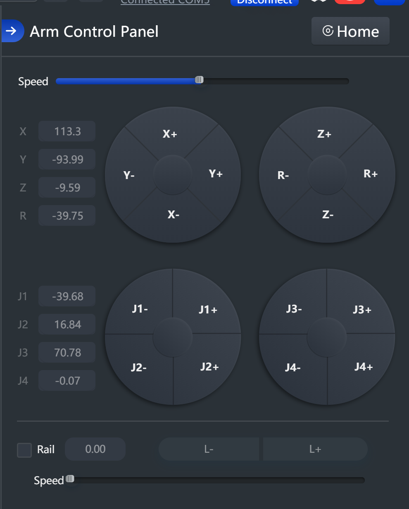
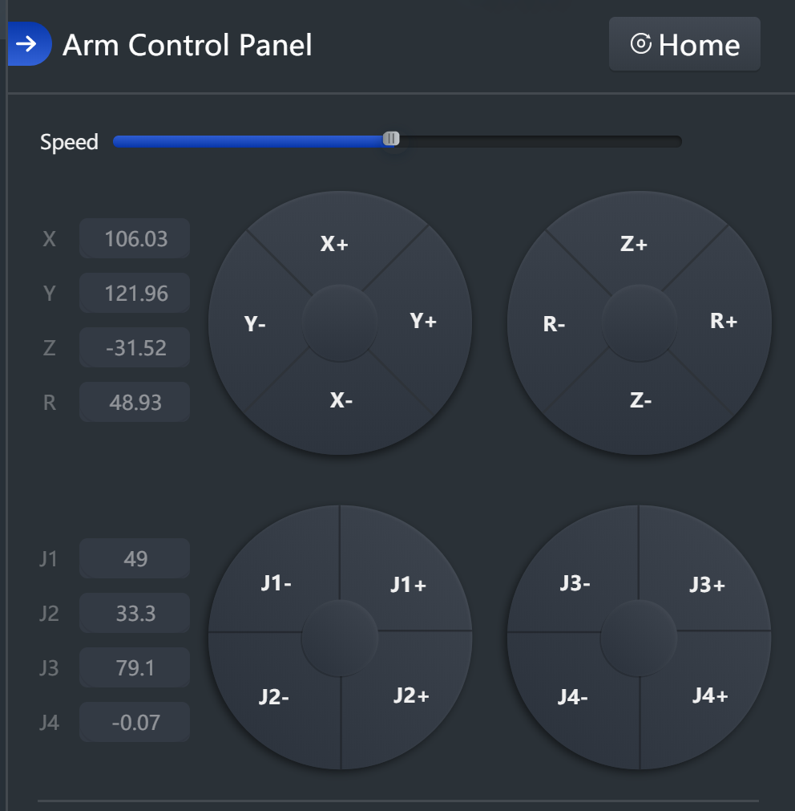
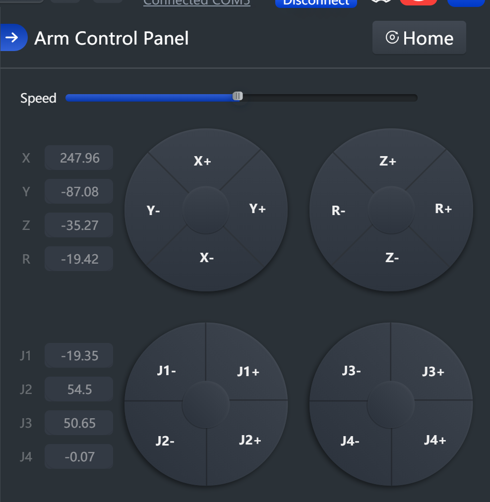
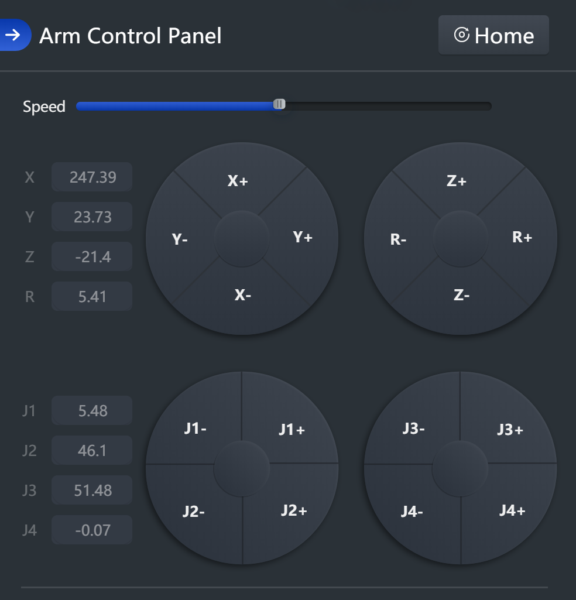
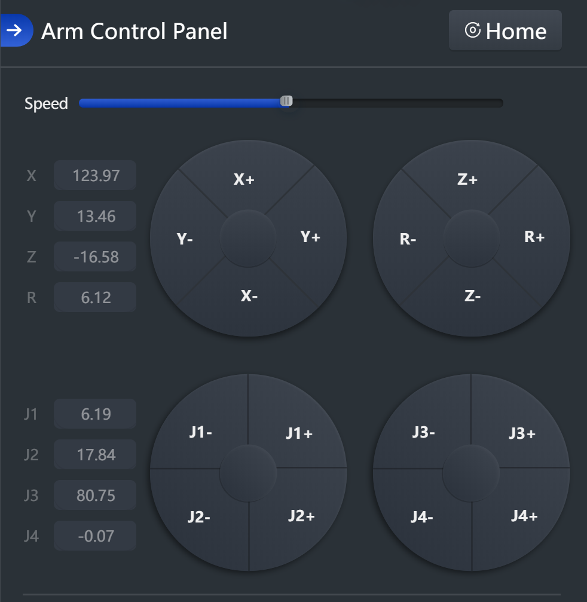
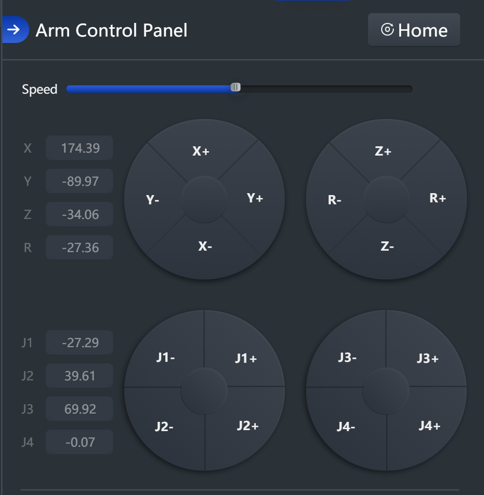
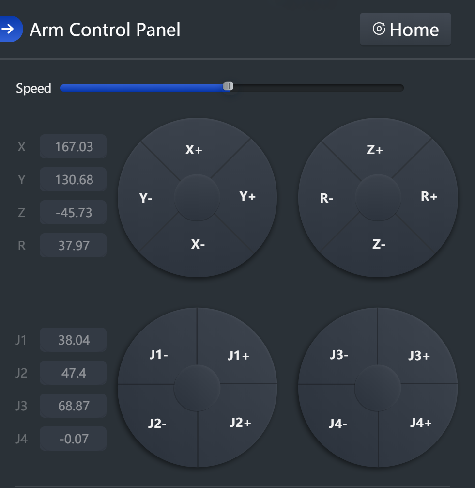

Get coordinate differences. How are the positions for my pattern, including the center starting 
position, different from the home position?

Then we can calculate the position based on the home position of the arm (below).

Ignore Z coords, because we'll set those to be constant so we can gather high quality height data. 
As long as the arm doesn't complain about any out of bounds coordinates (forgot the exact error),
then we're good on the constant Z setting.

# Home position:

# Center (starting) position:

# bottom_right

# top_left

# bottom_left

# top_right 

# top_middle

# bottom_middle

# right_middle

 

# left_middle

